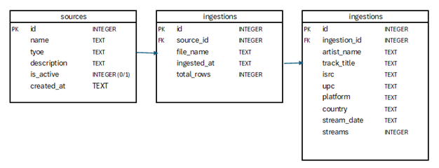
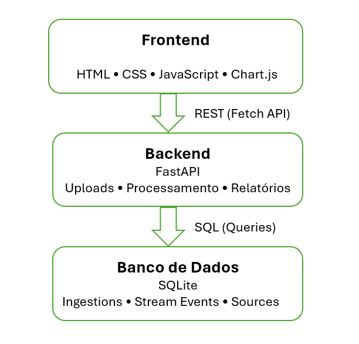

# BRD Hub  
### Sistema Unificado de Distribuição Musical  

---

Fábio Briddi

Este documento apresenta a documentação do projeto desenvolvido na unidade curricular Projeto de Desenvolvimento II do curso de Análise e Desenvolvimento de Sistemas do Centro Universitário Senac-RS. O sistema proposto visa unificar e apresentar as informações de distribuições musicais através das APIs das distribuidoras digitais em uma interface.

---

## 📘 Resumo do Projeto

O avanço do consumo de música em plataformas digitais provocou um aumento expressivo na geração de dados relacionados ao desempenho de artistas, faixas e catálogos. No entanto, a ausência de ferramentas simples, unificadas e acessíveis torna difícil consolidar, armazenar e interpretar esses dados de forma eficiente. Este projeto apresenta o **BRD Hub**, uma aplicação web desenvolvida com o objetivo de possibilitar a consulta por APIs e uploads por arquivos, o processamento e a visualização de dados de distribuição de streaming musical. A solução utiliza **FastAPI** no backend, **SQLite** como banco de dados local e uma interface web elaborada em **HTML, CSS e JavaScript**, incluindo gráficos gerados com **Chart.js**.

---

## 🎯 Definição do Problema

No atual cenário, artistas independentes, gravadoras pequenas e gestores de artistas enfrentam desafios significativos no gerenciamento de suas distribuições musicais. As principais distribuidoras digitais operam de forma isolada, cada uma com sua própria solução, padrões de dados, interfaces de usuário e processos operacionais distintos. Esta fragmentação resulta em diversos problemas práticos que impactam diretamente a produtividade e a capacidade competitiva desses profissionais.  
A necessidade de acessar múltiplas plataformas separadamente demanda um tempo considerável e aumenta a probabilidade de erros operacionais. Profissionais precisam alternar entre diferentes sistemas, memorizar diferentes fluxos de trabalho e lidar com inconsistências nos formatos de dados retornados por cada distribuidora.  
A ausência de uma visão consolidada dificulta a análise comparativa de performance, impossibilitando a tomada de decisões estratégicas baseadas em dados agregados de todas as plataformas de distribuição. A falta de padronização nos relatórios e métricas entre distribuidoras torna o processo de benchmarking extremamente trabalhoso e propenso a interpretações inconsistentes.  
Adicionalmente, pequenos artistas e gravadoras independentes frequentemente carecem de recursos técnicos para desenvolver integrações customizadas com cada API, limitando sua capacidade de competir efetivamente no mercado digital. A complexidade técnica das integrações, que exige conhecimento em autenticação OAuth, tratamento de rate limiting e normalização de dados heterogêneos, representa barreira significativa à entrada no mercado de distribuição digital.

---

## 🎯 Objetivos

### Objetivo Geral

Criar uma solução web capaz de centralizar dados de streaming musical, recebidos via APIs ou upload de arquivos, armazenando-os em banco de dados e apresentando visualizações simples e intuitivas para análise.  

### Objetivos Específicos

- Implementar um backend para consumir APIs e receber arquivos e disponibilizar relatórios.
- Modelar um banco de dados para armazenar eventos de streaming.
- Criar uma interface web funcional para upload, navegação e consulta.
- Desenvolver gráficos e tabelas que complementem a interpretação dos dados.
- Possibilitar futura expansão para conectores reais de plataformas digitais.

---

## 🛠️ Stack Tecnológico

- **FastAPI** — backend e processamento dos arquivos.
- **Python 3** — linguagem principal do projeto.
- **SQLite** — armazenamento local dos dados.
- **HTML + CSS + JavaScript** — desenvolvimento da interface.
- **Chart.js** — geração de gráficos.
- **Fetch API** — comunicação entre front-end e backend.

---

## 🧩 Descrição da Solução

O BRD Hub é composto por:

### **1. Interface Web**
Permite:
- navegação por módulos (insights, uploads, conectores, usuários);
- envio de arquivos;
- visualização de métricas resumidas;
- exibição de gráficos e tabelas.

> **[TELA INICIAL DO SISTEMA]**

> **[TELA DE INSIGHTS COM GRÁFICOS]**

### **2. Backend FastAPI**
Responsável por:
- ingestão dos arquivos enviados;
- tratamento e validação dos dados;
- inserção no banco de dados;
- consultas agregadas para relatórios;
- histórico de uploads processados.

### **3. Banco de Dados SQLite**
Estrutura básica:
- **sources**  
- **ingestions**  
- **stream_events**

> **[DIAGRAMA ENTIDADE-RELACIONAMENTO (DER)]**

---

## 🏗️ Arquitetura da Aplicação

Representação simplificada da arquitetura:

---

## 🔍 Validação do Sistema

A validação foi conduzida por meio de testes funcionais, incluindo:

- uploads repetidos de arquivos de diferentes estruturas;
- verificação do armazenamento correto no banco de dados;
- análise da exibição de métricas e gráficos no front-end;
- comparação dos resultados apresentados com os valores esperados dos arquivos.

Casos extremos também foram testados, como:

- CSVs com colunas ausentes;
- arquivos vazios;
- valores inconsistentes.

> **[PRINTS DE TESTES E RESULTADOS]**

---

## 📊 Estratégia de Análise

O sistema organiza os dados para permitir interpretações como:

- volume total de streams armazenados;
- número de artistas únicos;
- artistas mais executados;
- plataformas com maior participação;
- número total de uploads processados.

Essas análises visam oferecer uma visão exploratória simples, porém útil, do comportamento dos dados inseridos.

> **[GRÁFICOS EXPORTADOS DO BRD HUB]**

---

## 📈 Consolidação dos Resultados

Após os testes, concluiu-se que:

- o sistema processa corretamente arquivos de diferentes origens;
- a API retorna resultados consistentes nos relatórios;
- o dashboard favorece a compreensão inicial das métricas principais;
- a organização modular do código facilita expansões futuras.

---

## 🏁 Conclusões

O BRD Hub demonstrou viabilidade como uma ferramenta compacta e intuitiva para centralização e visualização de dados de streaming musical. A aplicação cumpre o propósito educacional e técnico, permitindo compreender na prática:

- a construção de uma API REST moderna;
- a modelagem e manipulação de dados;
- a integração front-end ↔ back-end;
- a geração de insights a partir de dados estruturados.

O projeto estabelece uma base sólida para desenvolvimentos futuros, podendo evoluir para uma solução robusta e completa.

---

## 🚧 Limitações e Trabalhos Futuros

### Limitações identificadas
- Falta de filtros avançados (por período, país, faixa etc.);
- Dependência de uploads manuais de arquivos CSV;
- Visualizações ainda introdutórias.

### Propostas de aprimoramento
- Desenvolvimento de conectores reais (APIs de distribuidoras);
- Sistema de relatórios exportáveis (PDF, Excel);
- Deploy em servidores cloud;
- Dashboard avançado com filtros interativos.

---

## 📚 Referências

- FastAPI Documentation — https://fastapi.tiangolo.com/
- SQLite Documentation — https://sqlite.org/docs.html
- Chart.js Documentation — https://www.chartjs.org/docs/latest/

---

## ✨ Autor

> **Nome do(a) aluno(a):** Fábio Briddi  
> **Curso:** Análise e Desenvolvimento de Sistemas  
> **Instituição:** Unisenac - Centro Universitário Senac-RS  
> **GitHub:** (https://github.com/FabioBriddi/Senac-ProjDesenv2-2025.git)  

