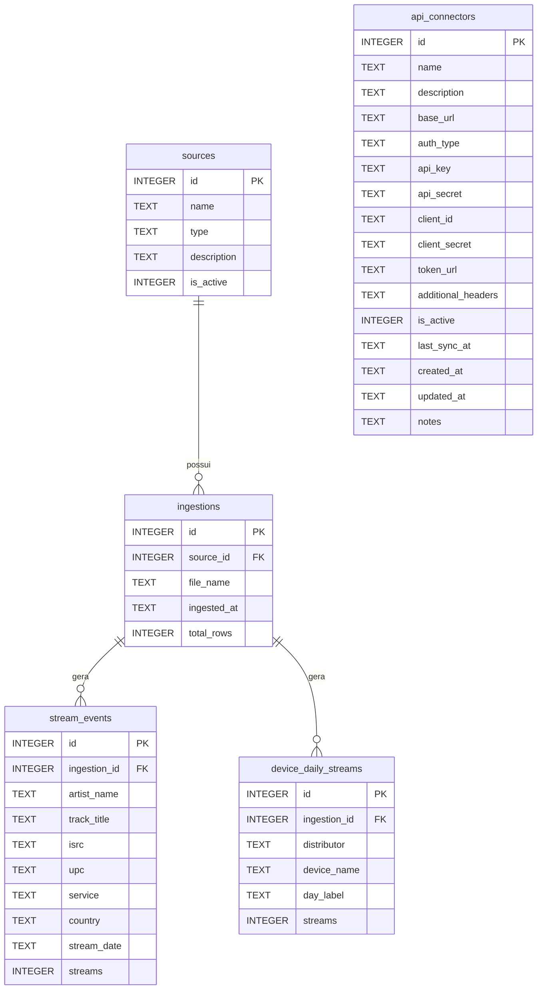

## 📊 Diagrama E-R

### Descrição das Tabelas

| Tabela | Descrição |
|--------|-----------|
| `sources` | Fontes de dados (CSV artistas, CSV dispositivos) |
| `ingestions` | Registro de cada upload/importação de arquivo |
| `stream_events` | Dados de streaming por artista/faixa (granularidade fina) |
| `device_daily_streams` | Dados agregados por dispositivo/dia/distribuidora |
| `api_connectors` | Configuração de conectores de API (FUGA, Vydia, The Orchard) |

### Relacionamentos

| Origem | Destino | Cardinalidade | Descrição |
|--------|---------|---------------|-----------|
| `sources` | `ingestions` | 1:N | Uma fonte pode ter múltiplas ingestões |
| `ingestions` | `stream_events` | 1:N | Uma ingestão gera múltiplos eventos de streaming |
| `ingestions` | `device_daily_streams` | 1:N | Uma ingestão gera múltiplos registros diários |
| `api_connectors` | - | Independente | Tabela de configuração para integrações futuras |
